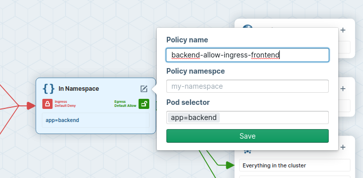
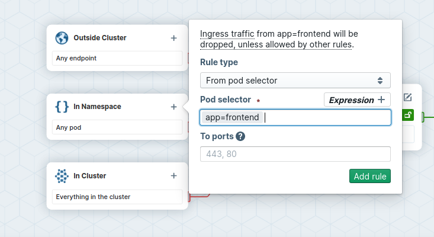
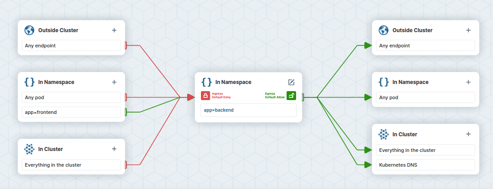

## Network Policies

One CNI function is the ability to enforce network policies and implement an in-cluster zero-trust container strategy. Network policies are a default Kubernetes object for controlling network traffic, but a CNI such as Cilium is required to enforce them. We will demonstrate traffic blocking with our simple app.

{}
If you are not yet familiar with Kubernetes Network Policies we suggest going to the [Kubernetes Documentation](https://kubernetes.io/docs/concepts/services-networking/network-policies/)
{}


## Task {}.1: Cilium Endpoints and Identities

Each Pod from our simple application is represented in Cilium as an [Endpoint](https://docs.cilium.io/en/stable/concepts/terminology/#endpoint). We can use the `cilium` tool inside a Cilium pod to list them.

First get all Cilium pods with:

```bash
kubectl -n kube-system get pods -l k8s-app=cilium
```

```NAME           READY   STATUS    RESTARTS        AGE
cilium-mvh65   1/1     Running   1 (6h26m ago)   6h30m
```

and then run:

```bash
kubectl -n kube-system exec <podname> -- cilium endpoint list
```

{}
Or we just execute the first pod of the daemonset:

```bash
kubectl -n kube-system exec ds/cilium -- cilium endpoint list
```
{}

Cilium will match these endpoints with labels and generate identities as a result. The identity is what is used to enforce basic connectivity between endpoints. We can see this change of identity:

```bash
kubectl run test-identity --image=nginx
sleep 5 # just wait for the pod to get ready
kubectl -n kube-system exec daemonset/cilium -- cilium endpoint list | grep -E -B4  'IDENTITY|run'
kubectl label pod test-identity this=that
sleep 5 # give some time to process
kubectl -n kube-system exec daemonset/cilium -- cilium endpoint list | grep -E -B4  'IDENTITY|run'
kubectl delete pod test-identity
```

We see that the number for this pod in the column IDENTITY has changed after we added another label. If you run `endpoint list` right after pod-labeling you might also see `waiting-for-identity` as the status of the endpoint.


## Task {}.2: Verify connectivity

Make sure your `FRONTEND` and `NOT_FRONTEND` environment variable are still set. Otherwise set them again:

```bash
FRONTEND=$(kubectl get pods -l app=frontend -o jsonpath='{.items[0].metadata.name}')
echo ${FRONTEND}
NOT_FRONTEND=$(kubectl get pods -l app=not-frontend -o jsonpath='{.items[0].metadata.name}')
echo ${NOT_FRONTEND}
```

Now we generate some traffic as a baseline test.

```bash
kubectl exec -ti ${FRONTEND} -- curl -I --connect-timeout 5 backend:8080
kubectl exec -ti ${NOT_FRONTEND} -- curl -I --connect-timeout 5 backend:8080
```

This will execute a simple `curl` call from the `frontend` and `not-frondend` application to the `backend` application:

```
# Frontend
HTTP/1.1 200 OK
X-Powered-By: Express
Vary: Origin, Accept-Encoding
Access-Control-Allow-Credentials: true
Accept-Ranges: bytes
Cache-Control: public, max-age=0
Last-Modified: Sat, 26 Oct 1985 08:15:00 GMT
ETag: W/"83d-7438674ba0"
Content-Type: text/html; charset=UTF-8
Content-Length: 2109
Date: Tue, 23 Nov 2021 12:50:44 GMT
Connection: keep-alive

# Not Frontend
HTTP/1.1 200 OK
X-Powered-By: Express
Vary: Origin, Accept-Encoding
Access-Control-Allow-Credentials: true
Accept-Ranges: bytes
Cache-Control: public, max-age=0
Last-Modified: Sat, 26 Oct 1985 08:15:00 GMT
ETag: W/"83d-7438674ba0"
Content-Type: text/html; charset=UTF-8
Content-Length: 2109
Date: Tue, 23 Nov 2021 12:50:44 GMT
Connection: keep-alive
```

and we see, both applications can connect to the `backend` application.

Until now ingress and egress policy enforcement are still disabled on all of our pods because no network policy has been imported yet selecting any of the pods. Let us change this.


## Task {}.3: Deny traffic with a Network Policy

We block traffic by applying the following network policy:



Create a file `backend-ingress-deny.yaml` with the above content.

The policy will deny all ingress traffic as it is of type Ingress but specifies no allow rule, and will be applied to all pods with the `app=backend` label thanks to the podSelector.

Ok, then let's create the policy with:

```bash
kubectl apply -f backend-ingress-deny.yaml
```

and you can verify the created Network Policy with:

```bash
kubectl get netpol
```

which gives you an output similar to this:

```
                                                    
NAME                   POD-SELECTOR   AGE
backend-ingress-deny   app=backend    2s

```


## Task {}.4: Verify connectivity again

We can now execute the connectivity check again:

```bash
kubectl exec -ti ${FRONTEND} -- curl -I --connect-timeout 5 backend:8080
kubectl exec -ti ${NOT_FRONTEND} -- curl -I --connect-timeout 5 backend:8080
```

but this time you see that the `frontend` and `not-frontend` application cannot connect anymore to the `backend`:

```
# Frontend
curl: (28) Connection timed out after 5001 milliseconds
command terminated with exit code 28
# Not Frontend
curl: (28) Connection timed out after 5001 milliseconds
command terminated with exit code 28
```

The network policy correctly switched the default ingress behavior from default allow to default deny. We can also check this in grafana.

{}
Note: our earlier grafana port-forward should still be running (can be checked by running jobs or `ps aux | grep "cilium-monitoring"`). If it does not open the URL from the command output below (or http://localhost:3000/dashboards with a local setup).

```bash
kubectl -n cilium-monitoring port-forward service/grafana --address 0.0.0.0 --address :: 3000:3000 &
echo "http://$(curl -s ifconfig.me):3000/dashboards"
```
{}


In Grafana browse to the dashboard `Hubble`. You should see now data in more graphs. Check the graphs `Drop Reason`, `Forwarded vs Dropped`. In  `Top 10 Source Pods with Denied Packets` you should find the name of the pods from our simple application.

Let's now selectively re-allow traffic again, but only from frontend to backend.


## Task {}.5: Allow traffic from frontend to backend

We can do it by crafting a new network policy manually, but we can also use the Network Policy Editor to help us out:


Above you see our original policy, we create an new one with the editor now.

* Go to https://networkpolicy.io/editor.
* Name the network policy to backend-allow-ingress-frontend (using the Edit button in the center).
* add app=backend as Pod Selector
* Set Ingress to default deny



* On the ingress side, add `app=frontend` as podSelector for pods in the same namespace.



* Inspect the ingress flow colors: the policy will deny all ingress traffic to pods labeled `app=backend`, except for traffic coming from pods labeled `app=frontend`.




* Copy the policy YAML into a file named backend-allow-ingress-frontend.yaml.

The file should look like this:



Apply the new policy:

```bash
kubectl apply -f backend-allow-ingress-frontend.yaml
```

and then execute the connectivity test again:

```bash
kubectl exec -ti ${FRONTEND} -- curl -I --connect-timeout 5 backend:8080
```

```bash
kubectl exec -ti ${NOT_FRONTEND} -- curl -I --connect-timeout 5 backend:8080
```

This time, the `frontend` application is able to connect to the `backend` but the `not-frontend` application still cannot connect to the `backend`:

```
# Frontend
HTTP/1.1 200 OK
X-Powered-By: Express
Vary: Origin, Accept-Encoding
Access-Control-Allow-Credentials: true
Accept-Ranges: bytes
Cache-Control: public, max-age=0
Last-Modified: Sat, 26 Oct 1985 08:15:00 GMT
ETag: W/"83d-7438674ba0"
Content-Type: text/html; charset=UTF-8
Content-Length: 2109
Date: Tue, 23 Nov 2021 13:08:27 GMT
Connection: keep-alive

# Not Frontend
curl: (28) Connection timed out after 5001 milliseconds
command terminated with exit code 28

```

Note that this is working despite the fact we did not delete the previous `backend-ingress-deny` policy:

```bash
kubectl get netpol
```

```
NAME                             POD-SELECTOR   AGE
backend-allow-ingress-frontend   app=backend    2m7s
backend-ingress-deny             app=backend    12m

```

Network policies are additive. Just like with firewalls, it is thus a good idea to have default DENY policies and then add more specific ALLOW policies as needed.

We can verify our connection being blocked with Hubble.

Generate some traffic.

```bash
kubectl exec -ti ${NOT_FRONTEND} -- curl -I --connect-timeout 5 backend:8080
```

With `hubble observe` you can now check the packet being dropped as well as the reason why (Policy denied).

{}
Our earlier `cilium hubble port-forward` should still be running (can be checked by running jobs or `ps aux | grep "cilium hubble port-forward"`). If it does not, Hubble status will fail and we have to run it again:

```bash
cilium hubble port-forward&
hubble status
```

{}

```bash
hubble observe --from-label app=not-frontend
```

And the output should look like this:
```bash
Jan 13 12:54:46.883: default/not-frontend-8f467ccbd-lh4w4:50802 -> kube-system/coredns-64897985d-7rjfv:53 to-endpoint FORWARDED (UDP)
Jan 13 12:54:46.883: default/not-frontend-8f467ccbd-lh4w4:50802 -> kube-system/coredns-64897985d-7rjfv:53 to-endpoint FORWARDED (UDP)
Jan 13 12:54:46.884: default/not-frontend-8f467ccbd-lh4w4:37134 <> default/backend-65f7c794cc-pj2tc:8080 Policy denied DROPPED (TCP Flags: SYN)
Jan 13 12:54:46.884: default/not-frontend-8f467ccbd-lh4w4:37134 <> default/backend-65f7c794cc-pj2tc:8080 Policy denied DROPPED (TCP Flags: SYN)
Jan 13 12:54:47.906: default/not-frontend-8f467ccbd-lh4w4:37134 <> default/backend-65f7c794cc-pj2tc:8080 Policy denied DROPPED (TCP Flags: SYN)
Jan 13 12:54:47.906: default/not-frontend-8f467ccbd-lh4w4:37134 <> default/backend-65f7c794cc-pj2tc:8080 Policy denied DROPPED (TCP Flags: SYN)
Jan 13 12:54:49.922: default/not-frontend-8f467ccbd-lh4w4:37134 <> default/backend-65f7c794cc-pj2tc:8080 Policy denied DROPPED (TCP Flags: SYN)
Jan 13 12:54:49.922: default/not-frontend-8f467ccbd-lh4w4:37134 <> default/backend-65f7c794cc-pj2tc:8080 Policy denied DROPPED (TCP Flags: SYN)
```


## Task {}.6: Inspecting the cilium endpoints again

We can now check the cilium endpoints again.

```bash
kubectl -n kube-system exec -it ds/cilium -- cilium endpoint list
```

And now we see that the pods with the label `app=backend` now have ingress policy enforcement enabled.
