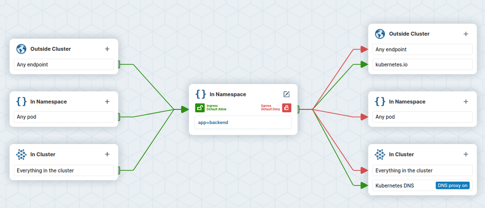

## Task {}.1: Create and use a DNS-aware Network Policy

Let's say we want to forbid our backend pods from reaching anything except FQDN kubernetes.io.

Let's make life a bit easier again by storing the `backend` Pod name into an environment variable:

```bash
BACKEND=$(kubectl get pods -l app=backend -o jsonpath='{.items[0].metadata.name}')
echo ${BACKEND}
```

and then let's check if we can reach `https://kubernetes.io` and `https://cilium.io`:

```bash
kubectl exec -ti ${BACKEND} -- curl -Ik --connect-timeout 5 https://kubernetes.io | head -1
```

```bash
kubectl exec -ti ${BACKEND} -- curl -Ik --connect-timeout 5 https://cilium.io | head -1
```

```
# Call to https://kubernetes.io 
HTTP/2 200 
# Call to https://cilium.io
HTTP/2 200 
```

Again, in Kubernetes, all traffic is allowed by default, and since we did not apply any Egress network policy for now, the backend is able to reach out anywhere.

Lets have a look at the following `CiliumNetworkPolicy`:



The policy will deny all egress traffic from pods labelled `app=backend` except when traffic is destined for `kubernetes.io` or is a DNS request (necessary for resolving `kubernetes.io` from coredns).



Create the file `backend-egress-allow-fqdn.yaml` with the above content and apply the network policy:

```bash
kubectl apply -f backend-egress-allow-fqdn.yaml
```

and check if the Cilium Network Policy was created:

```bash
kubectl get cnp                                
```

```
NAME                        AGE
backend-egress-allow-fqdn   2s
```

Note the usage of `cnp` (standing for `CiliumNetworkPolicy`) instead of the default netpol since we are using custom Cilium resources.

And check that the traffic is now only authorized when destined for `kubernetes.io`:

```bash
kubectl exec -ti ${BACKEND} -- curl -Ik --connect-timeout 5 https://kubernetes.io | head -1
```

```bash
kubectl exec -ti ${BACKEND} -- curl -Ik --connect-timeout 5 https://cilium.io | head -1
```

```
# Call to https://kubernetes.io 
HTTP/2 200 
# Call to https://cilium.io
curl: (28) Connection timed out after 5001 milliseconds
command terminated with exit code 28

```
{}
You can now check the `Hubble Metrics` dashboard in grafana again. The graphs under DNS should soon show some data as well. This is because with a Layer 7 Policy we have enabled the envoy in Cilium Agent.
{}

With the ingress and egress policies in place on `app=backend` pods, we have implemented a very simple zero-trust model to all traffic to and from our backend. In a real world scenario, cluster administrators may leverage network policies and overlay them at all levels and for all kinds of traffic in order to switch from the Kubernetes default of all traffic being allowed to only specific traffic being allowed.


## Task {}.2: Cleanup

To not mess up the proceeding labs we are going to delete the Cilium Network Policy again and therefore allow all egress traffic again:

```bash
kubectl delete cnp backend-egress-allow-fqdn
```
